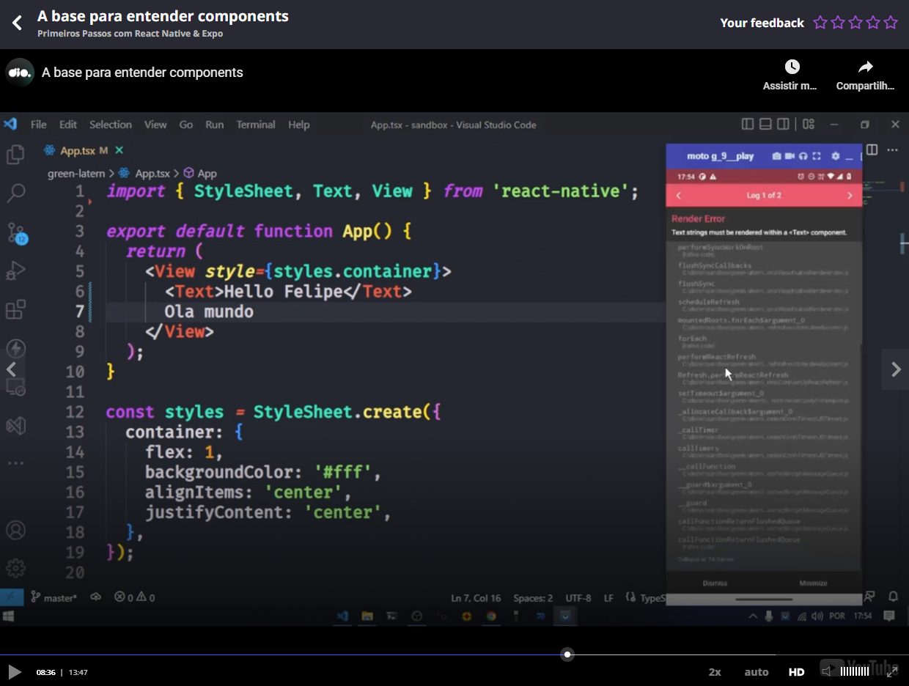
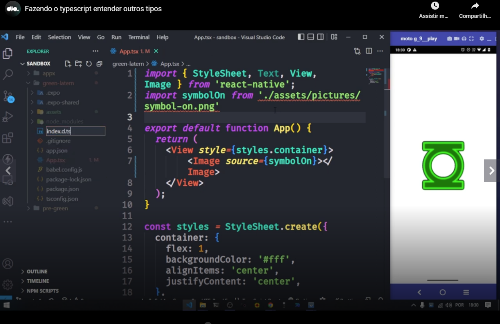
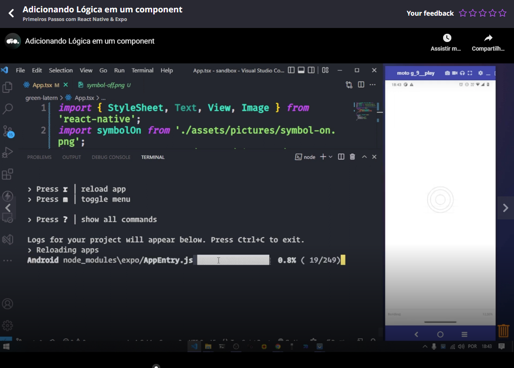
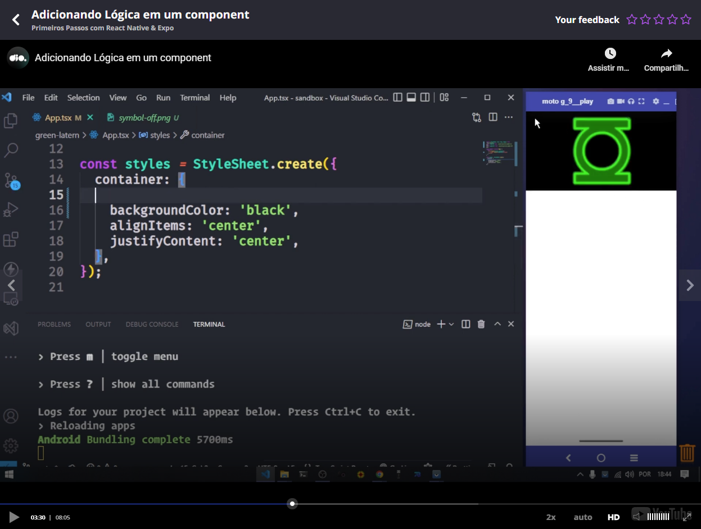
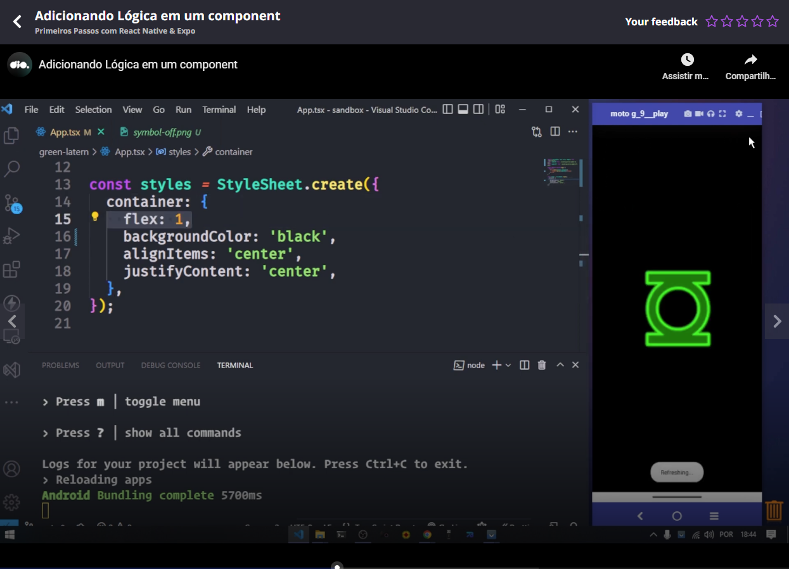
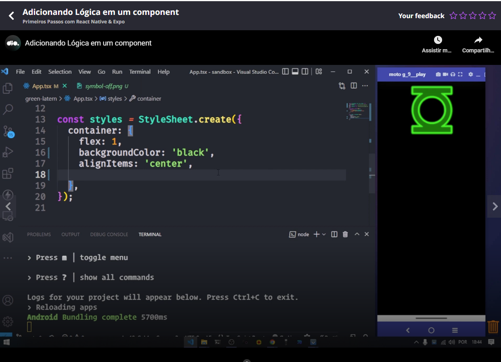
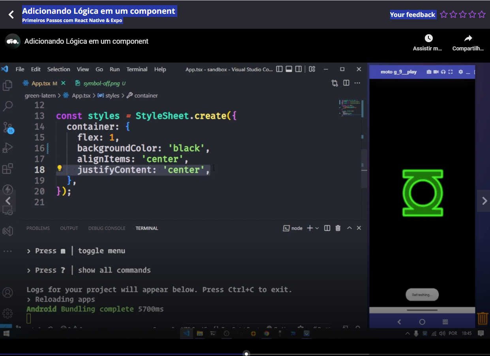

# Steps of the first test app

Please run the following command:

```
npx create-expo-app green-lantern -t
```

Then please select the template "Blank (TypeScript)".

The folder "green-lantern" (name that you inserted in the first command) was created. Please enter in this folder:

```
cd green-lantern
```

The run the next command:

```
npm run start
```

Then Expo presented a QR Code in terminal and teacher could scan this QR Code in the Expo app.

About the tags like "<TextInput></TextInput>" in the next image, teacher enforced that all needs to be imported (first line in the image).


And the image showed how to configure a CSS inline in the app.

Teacher referred the components (like TextInput) as like Lego pieces. And said to us that we can view the documentation when we need to see more about a specific component or we can use when we have an idea and needs to find a component that fits our idea:


The final version of the code of App.tsx our first App was:


Teacher showed the result of the app in the Vysor application in the PC.

Teacher also showed that if we insert a text that is not inside a component (like <Text />), you will see an error in the app.



A comment of the teacher: all components have the first letter uppercase.

See in some print of the documentation that we can have a class component or a component based on a function.


And that class components are more common in the past. Nowdays is more common components bases on functions.

As you can see in a previous image, there we have a line "export default **function App() { ... }**".

Teacher said that these functions are builded with a function that return only **one** component (in all cases show to us was the component <View>...</View>). If you return more than 1 external component you will have an error as result. Example (**wrong**):


# Styles

Teacher explained that the styles can be inline or not inline. Inline uses two brackets ("{{") to declare and not inline only one ("{"). See:


What will use to define a style, like was done in the image, is similar to CSS.

Obviously you can declare several configurations, but you need to separe the configurations using quotes. Please see this image:


If you wanna to declare several style configurations you can use StyleSheet.create. See:


See some CSS differences:

- The use of quotes separating the style configurations;
- The configurations, like "backgroundColor", are in camel case and not separated by dashes (like "background-color").

Please remember to import "StyleSheet":


# Comments

Comments can be inserted using **{/* this is a comment*/}**. **Teacher said we use this way because everything is an object in React Native world**.


# Images

Teacher showed the **"Image"** component from the documentation:


Please see the following example application loading an image:


Teacher needed:

- **1:** To import the **Image** component (top of the image example above);
- **2:** To import the image specifying its path;
- **3:** Use the **Image** component with the property source pointing the value the imported image in the step 2.

Teacher said that you can specify directly the image path specifying its path:


Please pay attention that he used double brackets ("{{}}") in the property source in this case.


# Avoiding a warning in VSCode

To avoid this warning, teacher told that this warning was related to TypeScript is be related to the existences of types and "png" not to be a type:



Please create a file index.d.ts with the content "declare module '*.png'":


# Reloading a app if a image was not found

Teacher said that this can be occur and in this case you have to stop the server, run it again (`npm run start`), then in the screen in the terminal after running the app again, please use the 'r' (reload) option.




# Random information

## Flex 1

Please use to image fill all area. Without "flex: 1" (when styling):



With "flex 1":




## Aligning vertically

Please use "justifyContent: 'center'".  Without "justifyContent: 'center'" (when styling):



With "justifyContent: 'center'":

